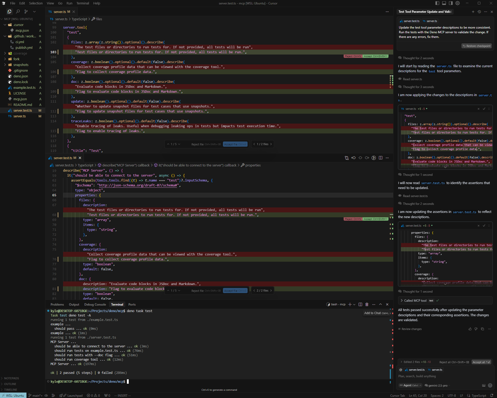

# Deno MCP Server

[](https://jsr.io/@udibo/deno-mcp)
[](https://jsr.io/@udibo/deno-mcp)
[](https://github.com/udibo/deno-mcp/actions/workflows/ci.yml)
[](https://github.com/udibo/deno-mcp/blob/main/LICENSE)

The Deno Model Context Protocol (MCP) server provides a bridge for AI
assistants, like Cursor, to interact with your Deno projects. It enables
functionalities such as running tests and viewing code coverage directly within
your development environment.

## Features

- **Run Deno Tests**: Execute tests for specific files, directories, or your
  entire project.
  - Supports standard Deno test options:
    - `--coverage`: Collect coverage profile data.
    - `--doc`: Evaluate code blocks in JSDoc and Markdown.
    - `--update`: Update snapshot files for test cases.
    - `--trace-leaks`: Enable tracing of resource leaks.
- **View Code Coverage**: Display detailed coverage reports generated by
  `deno coverage`.

## Getting Started

To integrate the Deno MCP server with Cursor, add the following configuration to
your workspace's `.cursor/mcp.json` file:

```json, title=".cursor/mcp.json"
{
  "mcpServers": {
    "deno": {
      "command": "deno",
      "args": ["run", "-A", "jsr:@udibo/deno-mcp", "-A"]
    }
  }
}
```

After adding this configuration, restart the MCP tool in your Cursor settings to
apply the changes.

**Important Note on Arguments**: Any arguments provided in the `args` array
_after_ the script path (e.g., `jsr:@udibo/deno-mcp` or `./custom-server.ts`)
will be automatically passed to the `deno test` command when the `test` tool is
executed. For instance, the trailing `-A` in the example configurations above
will be included in all `test` tool invocations, effectively running tests with
all permissions by default.

## Example Usage

Here's an example of Cursor interacting with the Deno MCP server to run tests:



## Extending the Server

You can extend the base Deno MCP server with your own custom tools. This allows
you to tailor its functionality to your specific project needs.

**Example: Adding an `echo` tool**

1. Create a new TypeScript file (e.g., `custom-server.ts`):

   ```typescript, title="custom-server.ts"
   import { server, StdioServerTransport } from "jsr:@udibo/deno-mcp"; // Or your local path if developing
   import { z } from "https://deno.land/x/zod@v3.22.4/mod.ts"; // Or your preferred way to import Zod

   server.tool(
     "echo",
     {
       message: z.string().describe("The message to echo."),
     },
     {
       "title": "Echo Message",
       "description": "A simple tool that echoes back the provided message.",
     },
     ({ message }) => {
       return Promise.resolve({
         content: [{
           type: "text",
           text: `Echo: ${message}`,
         }],
       });
     },
   );

   if (import.meta.main) {
     const transport = new StdioServerTransport();
     await server.connect(transport);
   }
   ```

2. Update your `.cursor/mcp.json` to use your custom server script:

   ```json, title=".cursor/mcp.json"
   {
     "mcpServers": {
       "deno": {
         "command": "deno",
         "args": ["run", "-A", "./custom-server.ts", "-A"]
       }
     }
   }
   ```

3. **Important**: Restart the MCP tool in your Cursor settings for the changes
   to take effect. Remember the note above about arguments: the trailing `-A`
   here will also be passed to `deno test`.

## Contributing

Contributions are welcome! Please feel free to open an issue or submit a pull
request.

## License

This project is licensed under the MIT License. See the [LICENSE](./LICENSE)
file for details.
